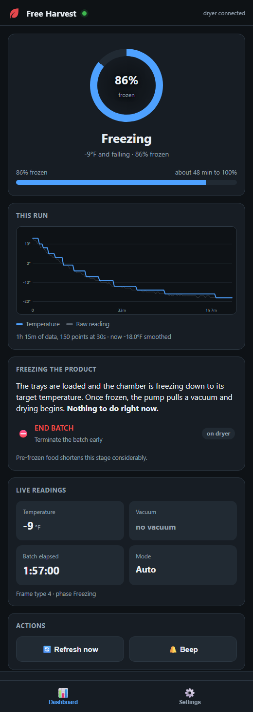
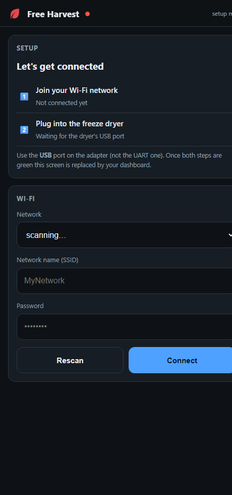
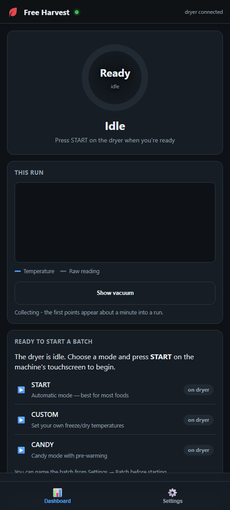
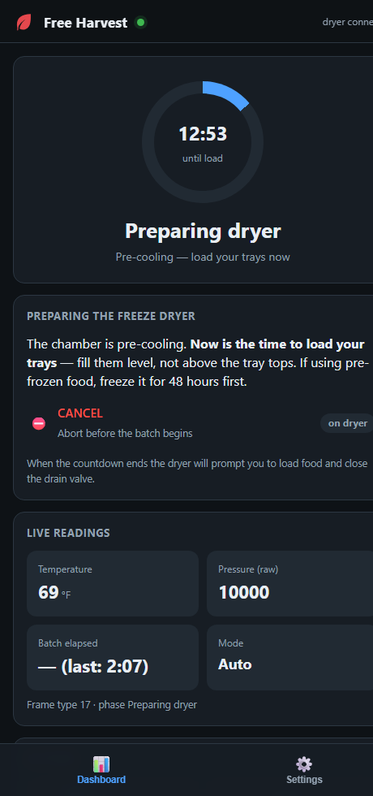
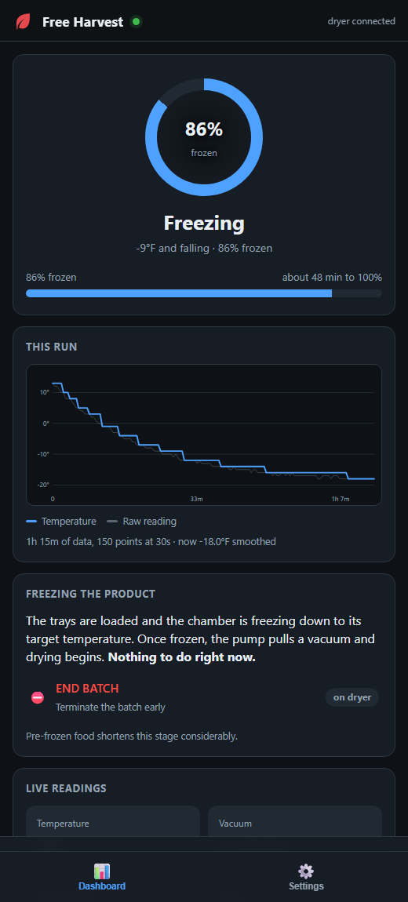
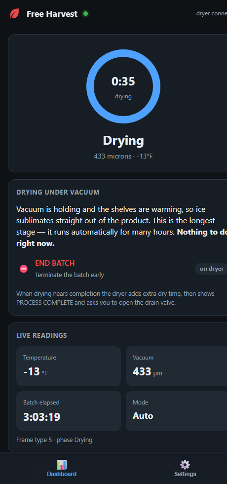
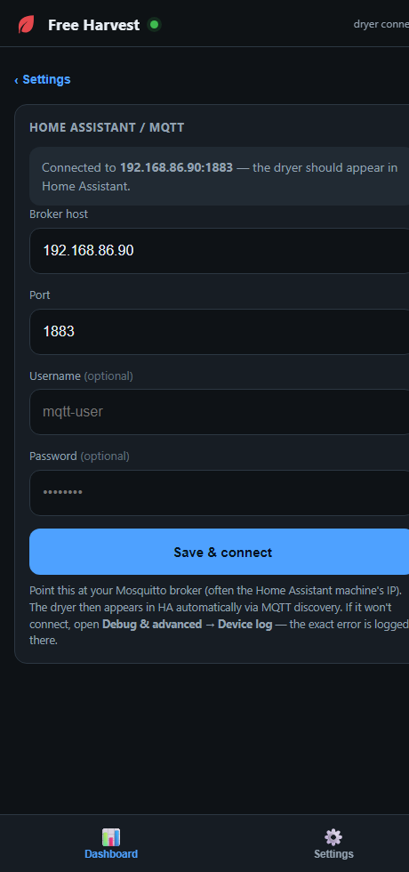
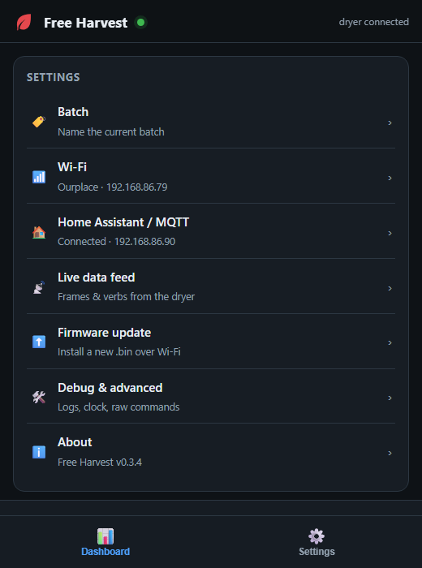

<h1>
 Free Harvest
</h1>

**Open-source Wi-Fi monitoring for Harvest Right freeze dryers, running entirely on a $10 ESP32-S3.**

Free Harvest replaces the proprietary Harvest Right Wi-Fi adapter with hardware you
own and firmware you can read. It plugs into the freeze dryer's USB port, decodes the
machine's telemetry, and serves a mobile-friendly web app — with optional MQTT so the
dryer appears in Home Assistant automatically.

No cloud account. No vendor lock-in. Runs standalone or on your own network.



---

## Contents

- [What it does](#what-it-does)
- [What it can't do (read this)](#what-it-cant-do-read-this)
- [Hardware](#hardware)
- [Install the firmware](#install-the-firmware)
- [First-time setup](#first-time-setup)
- [Normal operation](#normal-operation)
- [Home Assistant / MQTT](#home-assistant--mqtt)
- [Settings reference](#settings-reference)
- [Updating (OTA)](#updating-ota)
- [Troubleshooting](#troubleshooting)
- [Building from source](#building-from-source)
- [How it works](#how-it-works)
- [Contributing](#contributing)

---

## What it does

| | |
|---|---|
| 📊 **Live dashboard** | Cycle phase, temperature, vacuum (microns), batch + phase timers, countdowns |
| 🧭 **Phase-aware guidance** | Shows only the options valid right now, using the owner's-manual wording |
| 🏠 **Home Assistant** | MQTT auto-discovery — sensors appear automatically, no YAML |
| 📡 **Raw data feed** | Every frame the dryer sends, with changed-field highlighting |
| ⬆️ **OTA updates** | Flash new firmware from the web page; no cable |
| 🔒 **Local only** | Setup hotspot auto-closes after 5 minutes; nothing phones home |

Two ways to run it:

- **Standalone** — the ESP32 serves the whole app. Browse to its IP from any device
  on your network. Nothing else required.
- **With Home Assistant** — additionally publish to your MQTT broker for dashboards,
  history, and automations. (Use a VPN like WireGuard/Tailscale for outside access —
  don't port-forward it.)

---

## What it can't do (read this)

**Free Harvest cannot start, stop, or control a freeze-drying cycle.** This is a
hard limit of the dryer, not an unfinished feature.

The dryer's own firmware was disassembled to check. Its serial protocol accepts ~50
commands — all of them read data or change settings. There is **no** `START`,
`CONTINUE`, `DEFROST`, `MORE DRY TIME`, `END BATCH`, or equivalent. The touchscreen
drives the machine through an internal path the serial link cannot reach. This looks
deliberate: a freeze dryer runs vacuum pumps and heaters unattended for 24+ hours.

So the app shows you **what's happening and what to press next** — you press it on the
machine. Every option in the UI is tagged `on dryer` for exactly this reason.

What it *can* write: batch name, preferences, date/time, recipe push. Hardware-control
verbs (`DUTY`, `HCS`, `SPC`, `REBOOT`) are blocked in firmware and cannot be sent from
the app or MQTT, by design.

---

## Hardware

| Item | Notes |
|---|---|
| **ESP32-S3 board** | Must be **S3** (or S2) — needs native USB. An ESP32-S3-DevKitC-1 works best: https://amzn.to/4hGcVpa. ~$10. |
| **USB-C to USB-A cable** | From the board's **USB** port to the freeze dryer's USB-A port. |
| Freeze dryer | Harvest Right, firmware v6.x (developed against v6.4 / build 641041). |

> ### ⚠️ The original ESP32 will not work
> A classic ESP32 (WROOM-32, DevKitC-32) has **no USB device controller** — its USB
> port is only a serial bridge for flashing. It physically cannot present itself to
> the dryer. You need an **ESP32-S3**.

> ### ⚠️ Use the right port on the S3
> The DevKitC-1 has **two** USB-C sockets:
> - **`USB`** — native USB. **This one goes to the freeze dryer.**
> - **`UART`** — flashing/console bridge. Use this for the first flash only.

---

## Install the firmware

### Option A — pre-built binary (easiest)

1. Download `hr_wifi_adapter.bin` from the [latest release](../../releases).
2. Connect the board's **UART** port to your computer.
3. Flash with [esptool](https://github.com/espressif/esptool):

```bash
python -m esptool --chip esp32s3 -p COM7 -b 460800 write-flash 0x0 bootloader.bin 0x8000 partition-table.bin 0x20000 hr_wifi_adapter.bin
```

Replace `COM7` with your port (`/dev/ttyUSB0` on Linux, `/dev/cu.usbserial-*` on macOS).

### Option B — build it yourself

See [Building from source](#building-from-source).

After the first flash, **all future updates go over Wi-Fi** — see [Updating (OTA)](#updating-ota).

---

## First-time setup



**1. Power the board.** Any USB power source. It boots into setup mode.

**2. Join its hotspot.** On your phone or laptop, connect to the Wi-Fi network:

```
HR-Adapter-Setup
```

A setup page should open automatically (captive portal). If not, browse to
**http://192.168.4.1**.

**3. Pick your Wi-Fi.** Tap **Rescan**, choose your network, enter the password,
tap **Connect**.

> The page will briefly disconnect — that's normal and expected. The ESP32 has one
> radio, so joining your network moves the hotspot too. Wait a few seconds and it
> shows you the address to use.

**4. Note the address.** When connected it displays something like
`http://192.168.86.79/`. Bookmark it. (Or set a DHCP reservation in your router so
it never changes.)

**5. Plug into the dryer.** Connect the board's **USB** port to the freeze dryer's
USB-A port with the USB-C→USB-A cable. Within ~15 seconds the dot in the header turns
green and readings appear.

<br clear="right">

> 🔒 **Security note:** the setup hotspot stays open for **5 minutes only**. If no
> connection is made it shuts down and requires a reboot to reopen — so a router
> outage can't leave an open access point broadcasting indefinitely. Once connected
> to your network, the hotspot is disabled entirely.

---

## Normal operation

Browse to the adapter's address from any device on your network. The dashboard shows
whatever the dryer is doing right now.

| Idle | Preparing | Freezing | Drying |
|---|---|---|---|
|  |  |  |  |
| Press **START** on the machine | 15-min pre-cool, load your trays | % frozen + estimated time to 100% | Live vacuum in microns, phase timer |

The **phase card** below the dial always tells you what's happening and what comes
next, quoting the owner's manual — including the drain-valve steps that are easy to
get wrong.

Two actions are available from the app itself:

- **🔄 Refresh now** — asks the dryer for an immediate status update
- **🔔 Beep** — makes the dryer beep (handy for confirming the link end-to-end)

---

## Home Assistant / MQTT



Free Harvest connects to **your** broker as a client (the Mosquitto add-on is ideal).
It does not run a broker itself.

1. Go to **Settings → Home Assistant / MQTT**
2. Enter the broker host (usually your Home Assistant machine's IP)
3. Port **1883** for plain MQTT — *not* 8123 (HA's web UI) or 8443 (HTTPS)
4. Username / password if your broker requires them
5. **Save & connect**

The dryer then appears in Home Assistant automatically via MQTT discovery, as a device
with these entities:

| Entity | Type |
|---|---|
| Temperature | sensor (°F) |
| Pressure (raw) | sensor |
| State Code / Mode | sensor |
| Batch Elapsed / Prep Remaining | sensor (duration) |
| Refresh Status / Beep | button |
| Batch Name | text |

**Topics** (`<id>` is derived from the board's MAC):

```
hrdryer/<id>/state        telemetry JSON   (retained)
hrdryer/<id>/avail        online/offline   (retained, LWT)
hrdryer/<id>/frame        raw frames
hrdryer/<id>/cmd          → send a command
hrdryer/<id>/config/set   → set batch name
```

<br clear="right">

---

## Settings reference



| Section | Contains |
|---|---|
| **Batch** | Name the current batch |
| **Wi-Fi** | Network status, change network, forget network |
| **Home Assistant / MQTT** | Broker host, port, credentials, connection status |
| **Live data feed** | Verbs seen, live frame log, download capture |
| **Firmware update** | OTA upload |
| **Debug & advanced** | Device log, set dryer clock, raw commands, counters |
| **About** | Version number — quote this when reporting issues |

<br clear="right">

---

## Updating (OTA)

No cable needed after the first flash.

1. Download the new `hr_wifi_adapter.bin`
2. **Settings → Firmware update → choose file → Upload & install**
3. It writes to the spare slot, verifies, then reboots into the new version

If the upload fails or the file is invalid, it's **rejected and the current firmware
keeps running** — the device won't be bricked by a bad upload.

---

## Troubleshooting

**Start here: Settings → Debug & advanced → Device log.** The adapter's internal log is
visible in the browser and names the actual error.

| Symptom | Cause / fix |
|---|---|
| Dot stays red, no readings | Wrong USB port on the S3 — use the one labelled **USB**, not **UART** |
| MQTT won't connect, log shows `invalid header=0x48` | You pointed it at a web server. `0x48` is `H` from `HTTP` — use port **1883** |
| MQTT log shows `broker REFUSED: return_code=4/5` | Wrong username/password, or that user isn't authorised on the broker |
| MQTT log shows `TCP error: sock_errno=104/111` | Nothing listening — check Mosquitto is running and reachable on your LAN |
| Can't find the setup hotspot | It closes after 5 minutes. Power-cycle the board to reopen it |
| Shows "Ready" during a real batch | Normal for ~30s after a reboot: it must observe the elapsed counter advance before claiming a run |
| Page unreachable after Wi-Fi change | Its IP probably changed — check your router's client list |

---

## Building from source

Requires [ESP-IDF](https://docs.espressif.com/projects/esp-idf/en/latest/esp32s3/get-started/) **v5.0+** (developed on 6.0.1).

```bash
git clone https://github.com/SloPOS/free-harvest.git
cd free-harvest
idf.py set-target esp32s3
idf.py build
idf.py -p COM7 flash monitor
```

### Run the tests (no hardware needed)

The protocol core is plain C11 with no ESP-IDF dependencies, so it builds and runs on
your PC:

```bash
bash test/run_tests.sh
```

**201 checks across 8 suites.** Covers frame parsing, stream reassembly, frame
building, the command allow-list, telemetry decoding, phase detection, URL decoding,
and JSON output.

### Layout

```
components/hr_protocol/     portable core (no ESP-IDF deps, fully testable)
  hr_protocol.[ch]            framing: parse / build / reassemble
  hr_session.[ch]             link state machine, command allow-list
  hr_history.[ch]             frame ring buffer, per-verb table, field diffing
  hr_telemetry.[ch]           STAT decoding, cycle-phase detection
main/                       ESP-IDF layer
  main.c                      wiring
  hr_usb.[ch]                 TinyUSB CDC-ACM device (the dryer is USB host)
  hr_wifi.[ch]                provisioning, captive portal, AP timeout
  hr_http.[ch]                web server + REST API
  hr_mqtt.[ch]                MQTT client + Home Assistant discovery
  hr_log.[ch]                 in-app log capture
  www/index.html              the web app (single file, embedded in firmware)
test/                       host unit tests
tools/mock_dryer.py         simulate a dryer over serial (no hardware)
```

---

## How it works

The freeze dryer is a **USB host**; the adapter presents itself as a **USB CDC-ACM
device** (which is why an S3 is required). Over that link the dryer speaks a plain
ASCII protocol:

```
STAT,1,0,0,0,69,151882,0,0,38,0,1,QUALITY,v6.4,,
NTFY,1,0, ,0,
REQINFO,
```

Comma-delimited fields, terminated by CR. `STAT` is multiplexed — the field after the
verb is a **type discriminator** that changes the whole layout (type 17 is the
15-minute prep countdown, type 1 is normal status, type 15 is diagnostics, and so on).

Field meanings were recovered by correlating live captures against the machine's
screen and against strings in the dryer's own firmware.

📄 **[decoded/PROTOCOL_NOTES.md](decoded/PROTOCOL_NOTES.md)** documents the wire format,
every known verb, and which fields are confirmed vs. inferred.

### Known gaps

- **Freezing and drying are detected** (STAT types 4 and 5), with live % frozen,
  an estimated time to 100%, real vacuum readings and a per-phase timer. Extra-dry
  time, process-complete and defrost haven't been captured yet and still read as
  "Batch running".
- **Field meanings marked "inferred"** in the protocol notes need confirmation.

Captures are very welcome — see below.

---

## Contributing

The most useful contribution right now is **a full-cycle capture**: run a batch with
the adapter attached, then **Settings → Live data feed → Download log**, and open an
issue with the file. That unlocks sub-phase detection and the pressure scale.

Code contributions welcome. Please keep the portable core (`components/hr_protocol/`)
free of ESP-IDF dependencies and covered by tests — `bash test/run_tests.sh` must pass.

---

## Licence

MIT — see [LICENSE](LICENSE).

Not affiliated with, endorsed by, or supported by Harvest Right. "Harvest Right" is a
trademark of its respective owner. Use at your own risk; this software does not control
your freeze dryer and cannot make it unsafe, but you are responsible for your machine.
